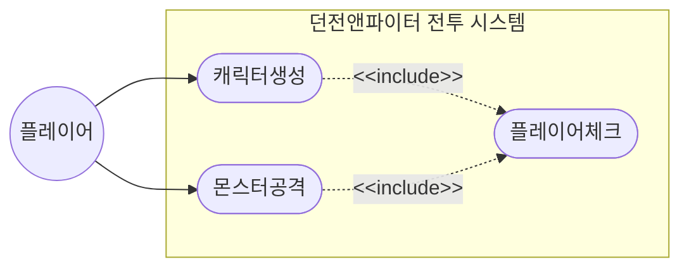

```mermaid
graph LR
    Actor((플레이어))

    subgraph System["던전앤파이터 전투 시스템"]
        UC1([캐릭터생성])
        UC2([몬스터공격])
        UC3([플레이어체크])
    end

    Actor --> UC1
    Actor --> UC2

    UC1 -. "&lt;&lt;include&gt;&gt;" .-> UC3
    UC2 -. "&lt;&lt;include&gt;&gt;" .-> UC3
```
