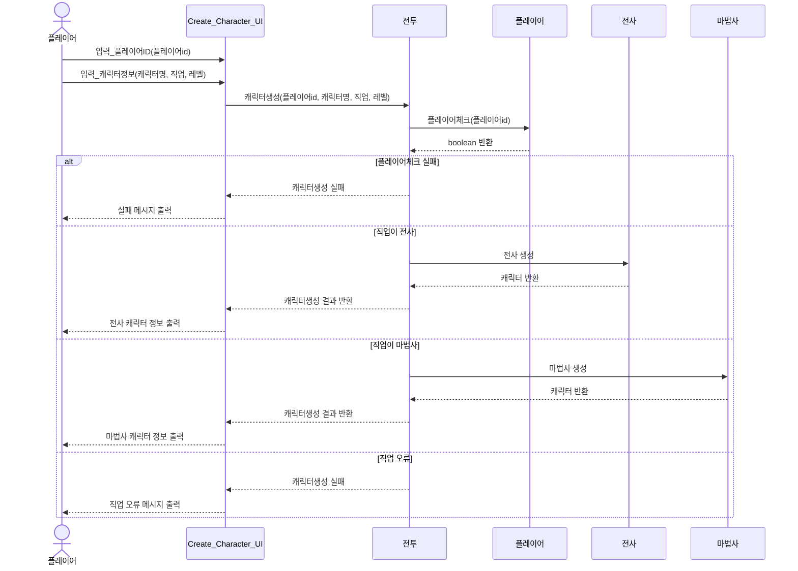

## 캐릭터생성 Sequence Diagram

```mermaid
sequenceDiagram
    actor 사용자 as 플레이어
    participant UI as Create_Character_UI
    participant Battle as 전투
    participant Player as 플레이어
    participant Warrior as 전사
    participant Mage as 마법사

    사용자->>UI: 입력_플레이어ID(플레이어id)
    사용자->>UI: 입력_캐릭터정보(캐릭터명, 직업, 레벨)

    UI->>Battle: 캐릭터생성(플레이어id, 캐릭터명, 직업, 레벨)

    Battle->>Player: 플레이어체크(플레이어id)
    Player-->>Battle: boolean 반환

    alt 플레이어체크 실패
        Battle-->>UI: 캐릭터생성 실패
        UI-->>사용자: 실패 메시지 출력
    else 직업이 전사
        Battle->>Warrior: 전사 생성
        Warrior-->>Battle: 캐릭터 반환
        Battle-->>UI: 캐릭터생성 결과 반환
        UI-->>사용자: 전사 캐릭터 정보 출력
    else 직업이 마법사
        Battle->>Mage: 마법사 생성
        Mage-->>Battle: 캐릭터 반환
        Battle-->>UI: 캐릭터생성 결과 반환
        UI-->>사용자: 마법사 캐릭터 정보 출력
    else 직업 오류
        Battle-->>UI: 캐릭터생성 실패
        UI-->>사용자: 직업 오류 메시지 출력
    end
```
