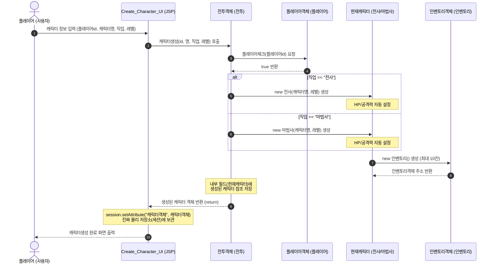

## 캐릭터생성 Sequence Diagram

```mermaid
sequenceDiagram
    autonumber
    actor Player as 플레이어 (사용자)
    participant UI as Create_Character_UI (JSP)
    participant Battle as 전투객체 (전투)
    participant Chk as 플레이어객체 (플레이어)
    participant Char as 현재캐릭터 (전사/마법사)
    participant Inv as 인벤토리객체 (인벤토리)

    Player ->> UI: 캐릭터 정보 입력 (플레이어id, 캐릭터명, 직업, 레벨)
    UI ->> Battle: 캐릭터생성(id, 명, 직업, 레벨) 호출
    
    %% 플레이어 체크
    Battle ->> Chk: 플레이어체크(플레이어id) 요청
    Chk -->> Battle: true 반환
    
    %% 전투 클래스 내부에서 캐릭터 생성
    alt 직업 == "전사"
        Battle ->> Char: new 전사(캐릭터명, 레벨) 생성
        note over Char: HP/공격력 자동 설정
    else 직업 == "마법사"
        Battle ->> Char: new 마법사(캐릭터명, 레벨) 생성
        note over Char: HP/공격력 자동 설정
    end
    
    %% Composition 관계에 따른 인벤토리 동시 생성
    Char ->> Inv: new 인벤토리() 생성 (최대 10칸)
    Inv -->> Char: 인벤토리객체 주소 반환
    
    %% 전투 클래스의 속성 구역에 일시 할당
    Note over Battle: 내부 필드(현재캐릭터)에<br/>생성된 캐릭터 참조 저장
    
    Battle -->> UI: 생성된 캐릭터 객체 반환 (return)
    
    %% UI(세션)에 저장하는 행위
    note over UI: session.setAttribute("캐릭터객체", 캐릭터객체)<br/>진짜 물리 저장소(세션)에 보관
    UI -->> Player: 캐릭터생성 완료 화면 출력
```
