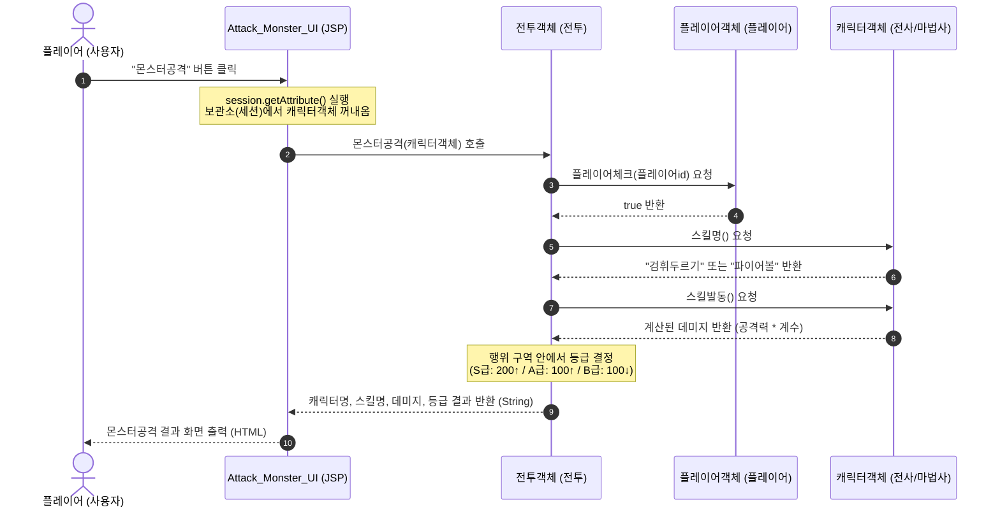

## 몬스터공격 Sequence Diagram

```mermaid
sequenceDiagram
    autonumber
    actor Player as 플레이어 (사용자)
    participant UI as Attack_Monster_UI (JSP)
    participant Battle as 전투객체 (전투)
    participant Chk as 플레이어객체 (플레이어)
    participant Char as 캐릭터객체 (전사/마법사)

    Player ->> UI: "몬스터공격" 버튼 클릭
    
    note over UI: session.getAttribute() 실행<br/>보관소(세션)에서 캐릭터객체 꺼내옴
    
    %% 전투를 위해 캐릭터를 전투 클래스로 전달
    UI ->> Battle: 몬스터공격(캐릭터객체) 호출
    
    %% 플레이어 체크
    Battle ->> Chk: 플레이어체크(플레이어id) 요청
    Chk -->> Battle: true 반환
    
    %% 전투 클래스 구역 안에서 캐릭터의 스킬 제어
    Battle ->> Char: 스킬명() 요청
    Char -->> Battle: "검휘두르기" 또는 "파이어볼" 반환
    
    Battle ->> Char: 스킬발동() 요청
    Char -->> Battle: 계산된 데미지 반환 (공격력 * 계수)
    
    note over Battle: 행위 구역 안에서 등급 결정<br/>(S급: 200↑ / A급: 100↑ / B급: 100↓)
    
    Battle -->> UI: 캐릭터명, 스킬명, 데미지, 등급 결과 반환 (String)
    UI -->> Player: 몬스터공격 결과 화면 출력 (HTML)
```
